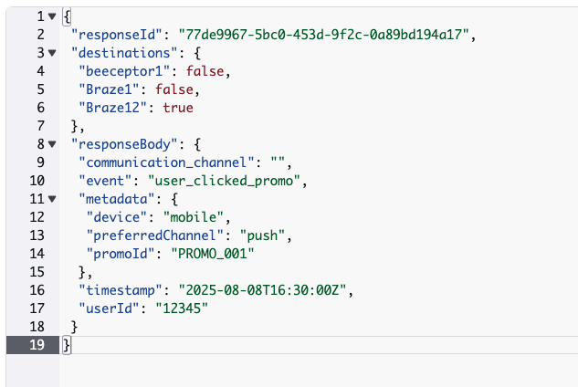

# CDP martech

This system collects events sent by users from their phones and computers and routes them to different destinations like analytics or notifications.

## Table of Contents

- [How It Works](#how-it-works)
- [Diagram](#diagram)
- [Requirements](#requirements)
- [Installation](#installation)
- [API Endpoints](#api-endpoints)
- [Database Schemas](#database-schemas)
- [Stack Selected](#stack-selected)

---

## How It Works

Users on phones and computers send events (such as actions or clicks) to a central API.

- The API puts these events into a queue (AWS SQS).
- A background processor (AWS Lambda) reads events from the queue and sends them to the right destinations:
  - Some events go to an analytics system to track user behavior.
  - Others go to a notification system to send alerts or messages.
- You can add new destinations with a simple API call; this happens immediately without needing to redeploy the Lambda function!

### In a nutshell, the functionality is:

1. User sends events through the API.
2. API call goes through API Gateway.
3. API Gateway forwards the event to the Martech Lambda.
4. Martech Lambda processes the event and sends it to a queue.
5. Queue triggers a destination Lambda.
6. Destination Lambda processes events for communication and analytics and sends the events.
7. Delivery status is saved in DynamoDB (`true` if successful, `false` if not).
   

### Below steps are **not implemented** yet:

8. If delivery fails, the message will be sent to a Dead Letter Queue (DLQ).
9. A separate Lambda will retry sending the message to the failing destination up to N times.
10. On success, the status in the database will be updated.
11. On failure after retries, the message will be deleted without changing the status.

---

### Communication Calls

- When a call goes to the communication flow, the `preferredChannel` determines the route.

Example:  
If `preferredChannel` is `email`, the endpoint will include `/email`.

### Analytics Calls

- Calls are forwarded as-is to the analytics software.

---

# Diagram


# Requirements

- [Python 3.13](https://www.python.org/downloads/release/python-3919/)
- [AWS CLI](https://docs.aws.amazon.com/cli/latest/userguide/getting-started-install.html)
- [Sam CLI](https://docs.aws.amazon.com/serverless-application-model/latest/developerguide/install-sam-cli.html)
- [Docker](https://www.docker.com/products/docker-desktop/)

# Installation

## Test current implementation

If you do not want to install all dependencies, you can test by requesting the current URLs from @caposcar:

1. In the current implementation there 3 beeceptor created, 2 of them function as analytics and one as communication.

1. [analytics](https://app.beeceptor.com/console/testoscar)
1. [analytics](https://app.beeceptor.com/console/testcomms)
1. [comms](https://app.beeceptor.com/console/testsrive)

1. Create destinations via the /destinations endpoint. (optional)

1. Send track events via /track.

## Mount the project in the cloud (Recommended)

Mounting the project needs an AWS accountt configured in the CLI , and SAM installed

1. Build the project

```bash
sam build
```

2. Deploy

```bash
sam deploy
```

3. Find your API URL in API Gateway under the MartechApi stage.

4. AWS SQS queue named events will be created automatically.

5. DynamoDB tables created:

- Destinations: stores event destinations.
- Responses: logs whether CDP calls succeeded.

6. Create destinations via the /destinations endpoint.

7. Send track events via /track.

## Locally (Not recommended as it depends in AWS SQS and dybamoDB)

Requires AWS account and existing SQS queue.

0. Create an SQS queue named events in AWS

1. Create two dynamoDB tables as the ones in table schema

2. Build the project

```bash
sam build
```

3. Start the local API:

```bash
sam local start-api
```

4. Invoke a function individually:

```bash
sam local invoke <FunctionLogicalID> -e <event_file.json>
```

# API Endpoints

### `POST /track`

Receive user events from phones and computers.

- **Request Body:**

  ```json
  {
    "userId": "12345",
    "event": "user_clicked_promo",
    "timestamp": "2025-08-08T16:30:00Z",
    "metadata": {
      "promoId": "PROMO_001",
      "device": "mobile",
      "preferredChannel": "email"
    }
  }
  ```

- **Request Response:**

200

```json
{
  "body": "{\"messageId\": \"messageId 45633db4-50c5-45db-bce0-8641da6a6efc\"}"
}
```

500

```json
{
  "error": ""
}
```

### `POST /destinations`

Create a new destination for the events

- **Request Body:**

  ```json
  {
  "destinationName": "Braze12",
  "url": "https://testsrive.free.beeceptor.com",
  "type":"CDP" "OR" "analytics",
  "headers": "",
  }
  ```

- **Request Response:**

200

```json
{
  "body": "{\"Destination created status\": \"success\"}"
}
```

500

```json
{
  "error": ""
}
```

# Databases schema

### Destinations

| Attribute       | Type                     | Description                       |
| --------------- | ------------------------ | --------------------------------- |
| destinationName | string                   | Name of the destination           |
| headers         | object                   | Headers needed for the API call   |
| Type            | string (CDP or analytcs) | Will tell the type of call needed |
| Url             | string                   | Where the call be made            |

### Responses

| Attribute    | Type   | Description                                          |
| ------------ | ------ | ---------------------------------------------------- |
| responseId   | string | Message Id                                           |
| responseBody | object | Payload send                                         |
| destinations | object | Status of each destination status {destiny: boolean} |

# Stack selected

Technology & Architecture Decisions
Language Selection
Python was chosen for its ability to deliver concise and fast MVPs, requiring minimal external libraries and offering highly readable syntax. The main drawback is its lack of static typing, which can cause confusion with object structures if Data Transfer Objects (DTOs) are not well-defined.

Framework & Deployment
AWS SAM was selected because it allows creating, deploying, invoking, and testing AWS services with just three simple commands. While alternatives like LocalStack and OpenStack were considered, SAM was preferred since all services were built exclusively on AWS, and provisioning resources directly in the cloud proved both fast and cost-effective.

Database Selection
DynamoDB was chosen for its seamless integration with AWS SAM’s YAML configuration, enabling quick and secure access during MVP development. Its flexible schema allowed experimentation until the optimal data model was found.

Project Structure
The project follows a modular architecture, grouping APIs, controllers, database access, models, queues, and utilities into dedicated directories under core for maintainability and scalability. Tests are kept in a separate folder for easy discovery. Configuration files and example events are placed at the root to simplify AWS SAM deployment and local testing.

Lambda Functions
Two Lambda functions were created: one dedicated to API calls and another for sending messages to queue destinations. This separation supports an asynchronous architecture, preventing bottlenecks and improving scalability.

Dead Letter Queue
A Dead Letter Queue (DLQ) was planned to capture events that failed to be delivered to analytics and communication tools for later retries. However, the DLQ and its associated Lambda were not implemented in this MVP.
