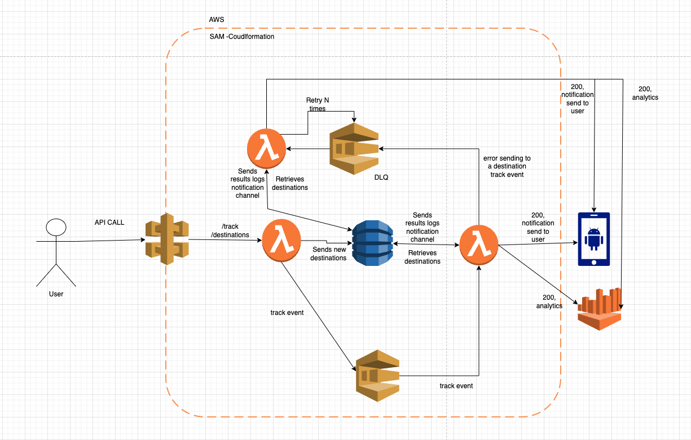

# CDP martech

This system collects events sent by users from their phones and computers and routes them to different destinations like analytics or notifications.

How It Works
Users on phones and computers send events (like actions or clicks) to a central API.

The API puts these events into a queue (AWS SQS)

A background processor (AWS Lambda) reads events from the queue and sends them to the right places:

Some events go to an analytics system to track user behavior.

Others go to a notification system to send alerts or messages.

You can new destinations with a simple API call, this will ocurr at the moment without needing to redeploy the lambda function!

# Diagram



# Requirements

- [Python 3.13](https://www.python.org/downloads/release/python-3919/)
- [AWS CLI](https://docs.aws.amazon.com/cli/latest/userguide/getting-started-install.html)
- [Sam CLI](https://docs.aws.amazon.com/serverless-application-model/latest/developerguide/install-sam-cli.html)
- [Docker](https://www.docker.com/products/docker-desktop/)

# Installation

## Mount the project in the cloud (Recommended)

Mounting the project needs an AWS accountt configured in the CLI , and SAM installed

1. Build the project using

```bash
sam build
```

2. Deploy using

```bash
make deploy
```

3. You can find your api URl entering api gateway and look for the MartechApi.

4. AWS SQS will be created with the name events

5. DynamoDB tables will be created with the names:

- Destinations: All the destinations the events can go to
- Responses: Logs if the CDP calls are succesfull or not.

## Locally (Not recommended as it depends in AWS SQS and dybamoDB)

Running the project localy needs an AWS accountt configured in the CLI , and a queue created in AWS

1. Create an SQS queue called events in AWS
2. Create two
3. Build the project using

```bash
sam local start-api
```

3. Run the local api using:

```bash
sam local start-api
```

4. Run a function individually

```bash
sam local invoke <FunctionLogicalID> -e <event_file.json>
```

# API Endpoints

### `POST /track`

Receive user events from phones and computers.

- **Request Body:**

  ```json
  {
    "userId": "12345",
    "event": "user_clicked_promo",
    "timestamp": "2025-08-08T16:30:00Z",
    "metadata": {
      "promoId": "PROMO_001",
      "device": "mobile",
      "preferredChannel": "email"
    }
  }
  ```

- **Request Response:**

200

```json
{
  "body": "{\"messageId\": \"messageId 45633db4-50c5-45db-bce0-8641da6a6efc\"}"
}
```

500

```json
{
  "error": ""
}
```

### `POST /destinations`

Create a new destination for the events

- **Request Body:**

  ```json
  {
  "destinationName": "Braze12",
  "url": "https://testsrive.free.beeceptor.com",
  "type":"CDP" "OR" "analytics",
  "headers": "",
  }
  ```

- **Request Response:**

200

```json
{
  "body": "{\"Destination created status\": \"success\"}"
}
```

500

```json
{
  "error": ""
}
```

# Databases schema

### Destinations

- destinationName : string = name of the destination
- headers: object = headers needed for the API call
- Type: string (CDP or analytcs) = will tell the type of call needed
- Url: string = Where the call be made

### Responses

- responseId: string: Message Id
- responseBody: object = payload send
- destinations: object = Status of each destination status
